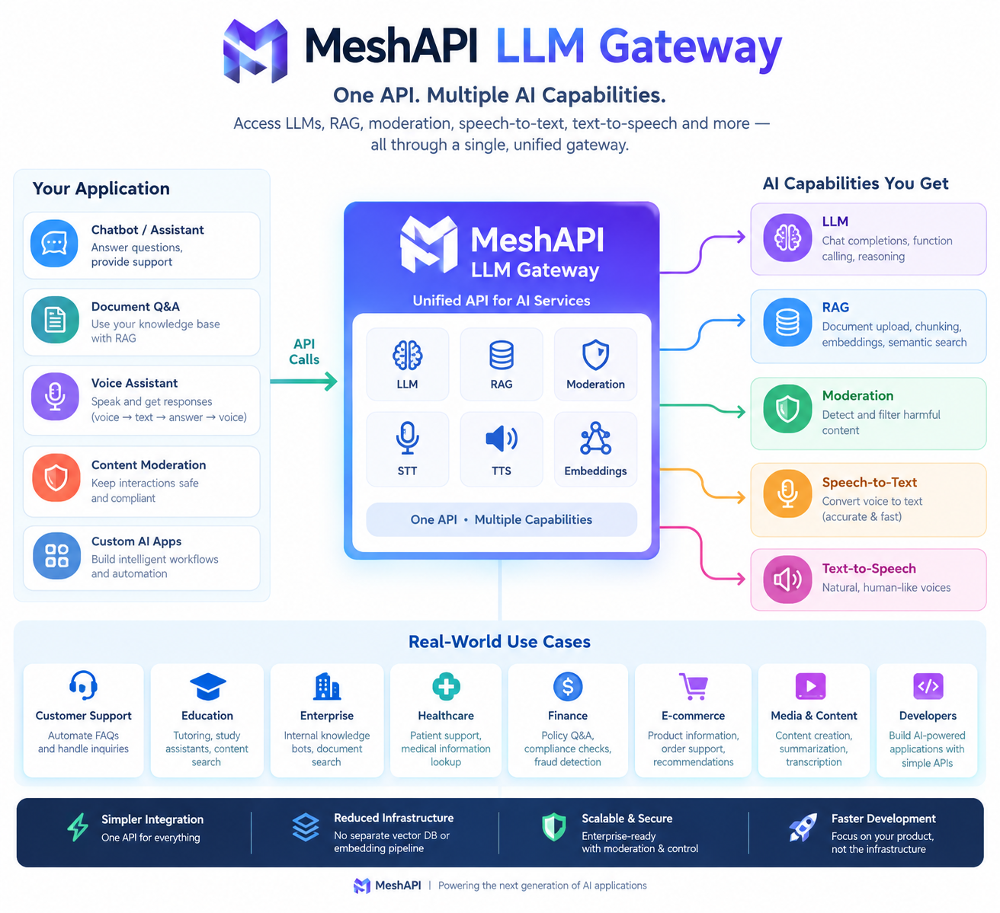
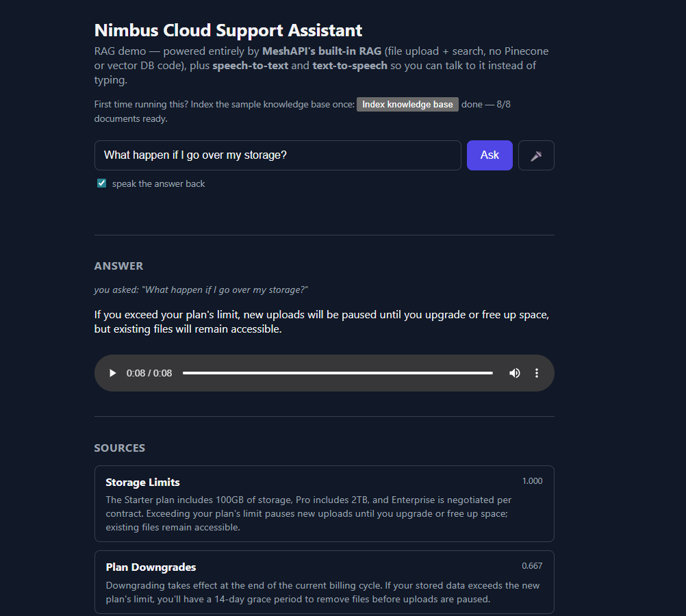
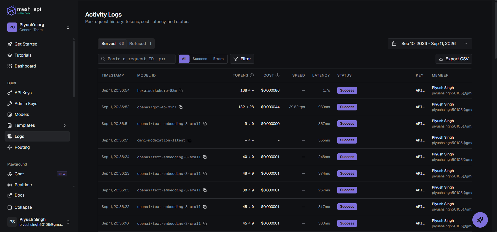
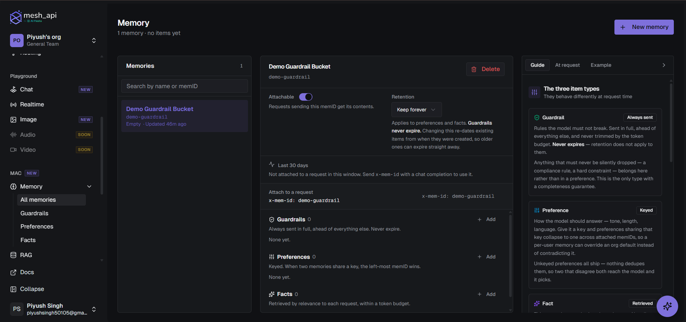
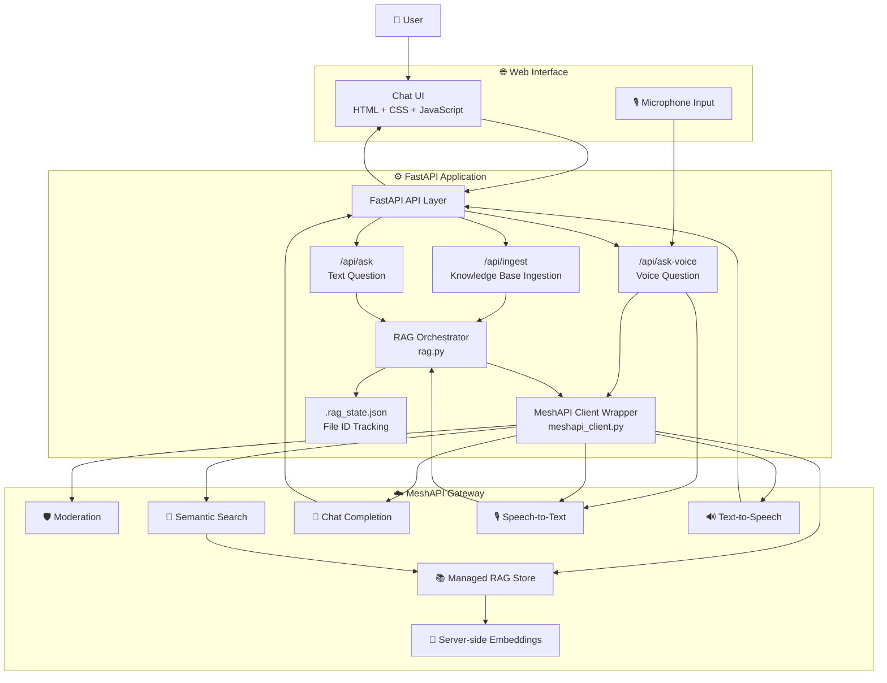
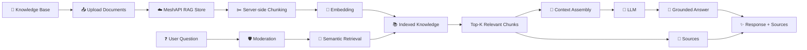
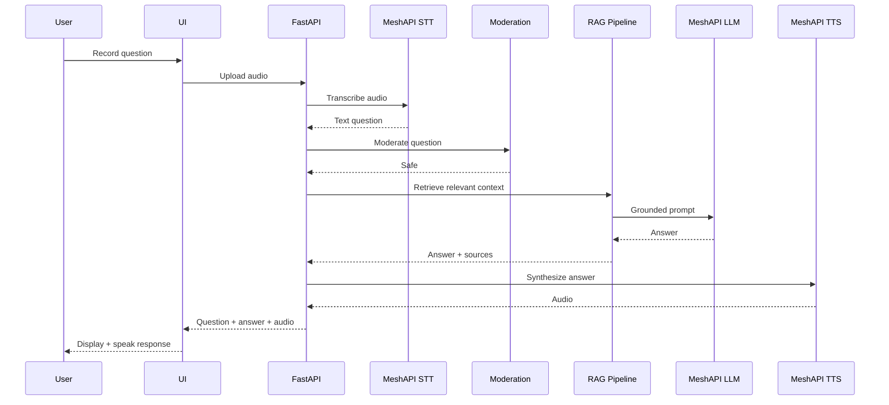
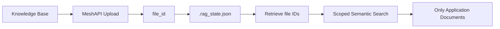
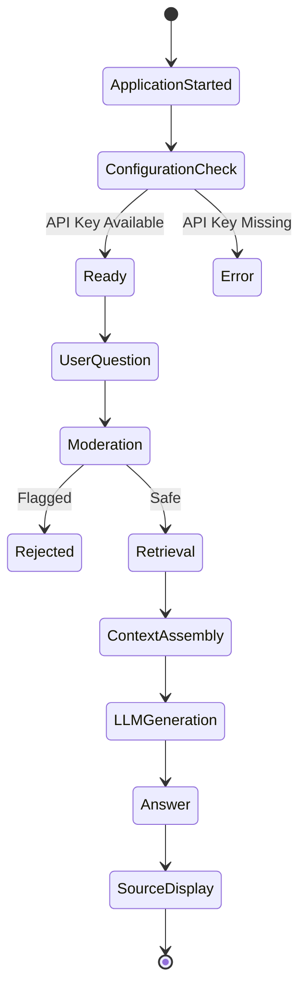

# 🧠 MeshAPI RAG Chatbot — LLM Gateway

<p align="center">

  <h1 align="center">⚡ MeshAPI RAG Chatbot</h1>

  <p align="center">
    <strong>A production-style Retrieval-Augmented Generation chatbot powered by MeshAPI</strong>
  </p>

  <p align="center">
    <a href="https://github.com/PiyushVIT346/MeshAPI-RAG-chatbot---LLM-gateway">
      
    </a>
    
    
    
    
  </p>

</p>

---
<p align="center">
  
</p>
<p align="center">
  
</p>

---
## 🚀 Overview

**MeshAPI RAG Chatbot** is an AI-powered conversational application that combines **Retrieval-Augmented Generation (RAG)** with the **MeshAPI LLM gateway** to produce grounded, context-aware responses.

Instead of relying only on the language model's internal knowledge, the application first retrieves semantically relevant information from a managed knowledge base and then provides that context to the LLM before generating an answer.

The application also integrates:

* 🔎 Semantic document retrieval
* 🧠 LLM-powered grounded generation
* 🛡️ Content moderation
* 🎙️ Speech-to-text
* 🔊 Text-to-speech
* 🌐 FastAPI REST APIs
* 💾 Persistent RAG file-state tracking
* 🖥️ Browser-based chatbot interface

The project demonstrates how a modern AI application can use a **single LLM gateway** to orchestrate multiple AI capabilities without manually implementing a separate vector database, embedding pipeline, speech service, and model provider integration.

---

# ✨ Key Features

<table>
<tr>
<td width="50%">

### 🧠 Retrieval-Augmented Generation

Retrieves the most relevant knowledge-base chunks before generating an answer.

</td>

<td width="50%">

### ⚡ MeshAPI LLM Gateway

Centralizes LLM, RAG, moderation, STT and TTS capabilities behind one API client.

</td>
</tr>

<tr>
<td>

### 🔎 Semantic Search

Uses MeshAPI's managed RAG store to perform semantic retrieval over uploaded documents.

</td>

<td>

### 🛡️ Content Moderation

User queries are checked before an LLM completion is executed.

</td>
</tr>

<tr>
<td>

### 🎙️ Voice Input

Users can ask questions using recorded audio.

</td>

<td>

### 🔊 Voice Output

Generated answers can be converted into speech and returned to the client.

</td>
</tr>

<tr>
<td>

### 📚 Source-Aware Answers

Retrieved chunks are returned alongside the generated response.

</td>

<td>

### 🔐 Environment-Based Configuration

API credentials and model configuration are loaded through environment variables.

</td>
</tr>
</table>
---
<h2 align="center">📸 Project Screenshots</h2>

<table align="center">
  <tr>
    <td align="center">
      
    </td>
    <td align="center">
      
    </td>
  </tr>
  <tr>
    <td align="center">
      
    </td>
    <td align="center">
      
    </td>
  </tr>
</table>

---

# 🏗️ Architecture

## System Architecture



---

## 🔄 RAG Pipeline

The core RAG pipeline follows:



---

# 🔁 How It Works

### 1. Knowledge Base Ingestion

The application contains a sample knowledge base consisting of documents describing topics such as:

* Refund Policy
* Storage Limits
* Data Retention
* Sharing & Permissions
* Two-Factor Authentication
* API Rate Limits
* Plan Downgrades
* Support Response Times

When `/api/ingest` is called, each document is uploaded to MeshAPI's managed RAG store.

MeshAPI handles:

```text
Document
   ↓
Chunking
   ↓
Embedding
   ↓
Managed RAG Storage
```

The application stores the resulting `file_id` values in `.rag_state.json`. This is important because the MeshAPI RAG store is account-wide, so the application uses these IDs to restrict subsequent searches to its own uploaded documents.

---

### 2. User Question

A user can submit either:

```text
Text Question
```

or:

```text
Voice Question
```

For text input:

```text
POST /api/ask
```

For voice input:

```text
POST /api/ask-voice
```

The FastAPI layer validates the request and passes the question to the RAG pipeline.

---

### 3. Content Moderation

Before performing an LLM request, the question is sent through MeshAPI's moderation endpoint.

```text
User Question
      ↓
Content Moderation
      ↓
   ┌───────────────┐
   │               │
Flagged          Safe
   │               │
Reject        Continue
```

This avoids spending an LLM request on a question that has already been identified as unsafe.

---

### 4. Semantic Retrieval

The question is sent to the MeshAPI managed RAG store.

The application retrieves the configured number of relevant chunks.

By default:

```text
RAG_TOP_K = 3
```

Each result contains:

* Similarity score
* Document title
* Retrieved text

The retrieved results are then converted into a compact context representation.

---

### 5. Grounded Generation

The retrieved chunks are inserted into the LLM prompt.

Conceptually:

```text
Context:
[Document A] relevant information...
[Document B] relevant information...
[Document C] relevant information...

Question:
User's question...
```

The model is explicitly instructed to answer using **only the retrieved context** and to say that it does not know when the answer is not present in the context.

This provides a simple grounding mechanism designed to reduce hallucination.

---

### 6. Voice Pipeline

The voice workflow is:



---

# 🧩 Project Structure

```text
MeshAPI-RAG-chatbot---LLM-gateway/
│
├── 📁 experiments/
│   └── Experimental / exploratory implementations
│
├── 📁 static/
│   └── Frontend static assets
│
├── 📁 templates/
│   └── index.html
│
├── 🐍 main.py
│   └── FastAPI application and API routes
│
├── 🧠 rag.py
│   └── RAG ingestion, retrieval and generation pipeline
│
├── 🔌 meshapi_client.py
│   └── MeshAPI SDK abstraction layer
│
├── ⚙️ config.py
│   └── Environment-based application configuration
│
├── 📚 data.py
│   └── Sample knowledge base
│
├── 📋 schemas.py
│   └── Request / response schemas
│
├── 🖼️ implementation.png
├── 🖼️ logs.png
├── 🖼️ memory_gaurdrills.png
│
└── 🖼️ Screenshots
```

The repository currently exposes the FastAPI application, RAG implementation, MeshAPI client abstraction, configuration, schemas, sample data, frontend assets, experiments, and several screenshots.

---

# 🛠️ Tech Stack

<div align="center">

| Layer                | Technology                     |
| -------------------- | ------------------------------ |
| Backend              | **FastAPI**                    |
| Programming Language | **Python**                     |
| LLM Gateway          | **MeshAPI**                    |
| RAG                  | **MeshAPI Managed RAG**        |
| Semantic Search      | **MeshAPI RAG Search**         |
| Embeddings           | **MeshAPI Managed Embeddings** |
| LLM                  | **Configurable MeshAPI Model** |
| Speech-to-Text       | **MeshAPI STT**                |
| Text-to-Speech       | **MeshAPI TTS**                |
| Moderation           | **MeshAPI Moderation**         |
| Frontend             | **HTML / CSS / JavaScript**    |
| Templates            | **Jinja2**                     |
| Configuration        | **python-dotenv**              |

</div>

The application intentionally keeps the AI infrastructure lightweight: one MeshAPI client provides chat completions, moderation, managed RAG upload/search, speech transcription, and speech synthesis.

---

# ⚙️ Configuration

The application reads configuration from environment variables.

Create a `.env` file:

```env
MESH_API_KEY=your_meshapi_api_key

MESHAPI_BASE_URL=https://api.meshapi.ai

MESHAPI_CHAT_MODEL=openai/gpt-4o-mini

RAG_TOP_K=3

MESHAPI_TTS_MODEL=hexgrad/kokoro-82m

MESHAPI_TTS_VOICE=af_heart

MESHAPI_STT_MODEL=elevenlabs/scribe_v1
```

The application requires `MESH_API_KEY` and validates its presence during startup.

### Configuration Parameters

| Variable             | Purpose                    | Default                  |
| -------------------- | -------------------------- | ------------------------ |
| `MESH_API_KEY`       | MeshAPI authentication     | Required                 |
| `MESHAPI_BASE_URL`   | MeshAPI endpoint           | `https://api.meshapi.ai` |
| `MESHAPI_CHAT_MODEL` | Chat model                 | `openai/gpt-4o-mini`     |
| `RAG_TOP_K`          | Number of retrieved chunks | `3`                      |
| `MESHAPI_TTS_MODEL`  | Text-to-speech model       | `hexgrad/kokoro-82m`     |
| `MESHAPI_TTS_VOICE`  | TTS voice                  | `af_heart`               |
| `MESHAPI_STT_MODEL`  | Speech-to-text model       | `elevenlabs/scribe_v1`   |

---

# 📦 Installation

## 1. Clone the repository

```bash
git clone https://github.com/PiyushVIT346/MeshAPI-RAG-chatbot---LLM-gateway.git
```

```bash
cd MeshAPI-RAG-chatbot---LLM-gateway
```

---

## 2. Create a virtual environment

### Windows

```cmd
python -m venv venv
```

Activate it:

```cmd
venv\Scripts\activate
```

### Linux / macOS

```bash
python3 -m venv venv
source venv/bin/activate
```

---

## 3. Install dependencies

Install the project's Python dependencies required by the application:

```bash
pip install fastapi uvicorn python-dotenv jinja2 python-multipart meshapi
```

> **Note:** The repository currently does not expose a `requirements.txt` in its root, so the command above reflects the imports used by the current implementation.

---

## 4. Configure MeshAPI

Create:

```text
.env
```

and add:

```env
MESH_API_KEY=your_api_key_here
```

You can also customize the model and RAG parameters using the variables described above.

---

# ▶️ Running the Application

Start the FastAPI server:

```bash
uvicorn main:app --reload
```

The application will be available at:

```text
http://127.0.0.1:8000
```

Open the URL in your browser.

---

# 🔌 API Endpoints

## `GET /`

Returns the chatbot web interface.

---

## `POST /api/ingest`

Uploads the sample knowledge base to MeshAPI's managed RAG store and waits for embedding processing.

### Example

```bash
curl -X POST http://127.0.0.1:8000/api/ingest
```

Response:

```json
{
  "documents_uploaded": 8,
  "embedded_ready": 8
}
```

The exact values depend on the knowledge base and embedding status.

---

## `POST /api/ask`

Answers a text-based question.

### Request

```json
{
  "question": "What is the refund policy?",
  "top_k": 3,
  "speak": false
}
```

### Response

```json
{
  "answer": "Nimbus Cloud offers a 30-day money-back guarantee...",
  "sources": [
    {
      "title": "Refund Policy",
      "score": 0.92,
      "text": "..."
    }
  ],
  "audio_base64": null
}
```

---

## `POST /api/ask-voice`

Accepts an audio recording and performs:

```text
Audio
 ↓
Speech-to-Text
 ↓
Moderation
 ↓
RAG Retrieval
 ↓
LLM Generation
 ↓
Text-to-Speech
 ↓
Response
```

The API returns:

* Transcribed question
* Generated answer
* Retrieved sources
* Base64-encoded audio response

The FastAPI implementation explicitly follows this sequence.

---

# 🧠 RAG Design

One of the interesting architectural decisions in this project is that the application **does not maintain its own vector database**.

A conventional RAG implementation might look like:

```text
Documents
   ↓
Chunking
   ↓
Embedding Model
   ↓
Vector Database
   ↓
Similarity Search
   ↓
LLM
```

This project instead delegates the infrastructure to MeshAPI:

```text
Documents
   ↓
MeshAPI Upload
   ↓
MeshAPI Chunking
   ↓
MeshAPI Embedding
   ↓
MeshAPI RAG Store
   ↓
MeshAPI Semantic Search
   ↓
FastAPI RAG Orchestrator
   ↓
MeshAPI LLM
```

This significantly reduces the amount of infrastructure that needs to be maintained by the application.

---

# 🔐 RAG Data Isolation

MeshAPI's file store is account-wide.

Therefore, simply performing a global search could potentially return documents uploaded by other applications using the same account.

This project solves the problem by:



The file IDs from the latest ingestion are persisted locally and supplied during search, preventing unrelated uploaded files from polluting retrieval results.

---

# 🛡️ Hallucination Reduction

The project uses several mechanisms to improve answer reliability.

### 1. Retrieval

Only semantically relevant chunks are supplied to the model.

### 2. Context Restriction

The prompt instructs the model to use only retrieved context.

### 3. Unknown Handling

If the answer cannot be found in the retrieved context, the model is instructed to respond that it does not know.

### 4. Source Return

The API returns the retrieved chunks along with the generated answer.

### 5. Low Temperature

The default chat temperature is:

```text
0.2
```

which favors more deterministic responses for the RAG use case.

---

# 🎙️ Multimodal Interaction

The chatbot supports both text and voice interaction.

<div align="center">

```text
                 ┌─────────────────────┐
                 │       USER          │
                 └──────────┬──────────┘
                            │
             ┌──────────────┴──────────────┐
             │                             │
             ▼                             ▼
       💬 Text Input                 🎙️ Voice Input
             │                             │
             │                       Speech-to-Text
             │                             │
             └──────────────┬──────────────┘
                            ▼
                    🛡️ Moderation
                            │
                            ▼
                     🔎 RAG Search
                            │
                            ▼
                      🧠 LLM Answer
                            │
                            ▼
                    ┌───────┴───────┐
                    │               │
                    ▼               ▼
               💬 Text         🔊 TTS Audio
```

</div>

---

# 📊 Application Flow



---

# 📸 Screenshots

The repository already contains implementation and UI screenshots that can be displayed directly from GitHub.

### Implementation


### Logs


### Memory / Guardrails


> Additional screenshots are available in the repository.

---

# 🧪 Example Questions

After ingesting the knowledge base, try questions such as:

```text
What is the refund policy?
```

```text
How much storage does the Pro plan provide?
```

```text
How long are deleted files retained?
```

```text
Is two-factor authentication mandatory?
```

```text
What are the API rate limits?
```

```text
How quickly does Enterprise support respond?
```

The chatbot should retrieve the relevant knowledge-base chunks before generating the response.

---

# 📁 Core Components

## `main.py`

Responsible for the HTTP application layer.

It exposes:

```text
GET  /
POST /api/ingest
POST /api/ask
POST /api/ask-voice
```

The file intentionally keeps orchestration lightweight while delegating RAG and MeshAPI functionality to separate modules.

---

## `rag.py`

Contains the main RAG orchestration.

Responsibilities:

```text
Ingestion
   ↓
Embedding Status Tracking
   ↓
Retrieval
   ↓
Context Construction
   ↓
Grounded LLM Generation
```

The main pipeline is explicitly organized as:

```text
ingest → retrieve → answer
```

---

## `meshapi_client.py`

Provides a thin abstraction over the MeshAPI SDK.

It centralizes:

* Chat completions
* Moderation
* RAG upload
* Embedding status
* Semantic search
* Speech-to-text
* Text-to-speech

This prevents the rest of the application from depending directly on raw SDK calls.

---

## `config.py`

Centralizes environment configuration.

Sensitive credentials are loaded from environment variables rather than hard-coded in the application.

---

## `data.py`

Contains the sample knowledge base used for demonstrating retrieval and grounded question answering.

---

# 💡 Why This Project?

Traditional LLM applications often require developers to integrate and maintain multiple independent services:

```text
LLM Provider
Vector Database
Embedding Model
Speech-to-Text
Text-to-Speech
Moderation
Authentication
```

This project explores an alternative architecture where an **LLM gateway abstracts many of these AI capabilities behind a unified interface**.

The result is a smaller application codebase with fewer infrastructure dependencies while still supporting a complete RAG + voice chatbot workflow.

---

# ⚡ Advantages

### Reduced Infrastructure

No separate vector database or embedding pipeline is required by the application.

### Unified AI Interface

Chat, RAG, moderation, STT and TTS are accessed through one MeshAPI client.

### Modular Design

The application separates:

```text
API Layer
    ↓
RAG Layer
    ↓
Gateway Client
    ↓
AI Services
```

### Grounded Responses

The LLM receives retrieved context rather than answering solely from its pretrained knowledge.

### Voice Support

The same RAG pipeline can be accessed through spoken questions.

---

# ⚠️ Current Limitations

This repository is primarily a demonstration of MeshAPI-native RAG architecture.

Current limitations include:

* The sample knowledge base is statically defined in `data.py`.
* RAG ingestion currently uploads the bundled knowledge base.
* `.rag_state.json` is local application state.
* The MeshAPI managed RAG store is account-wide.
* The project does not currently expose a separate production authentication layer.
* The repository does not currently include automated CI/CD tests.
* The application currently focuses on a single knowledge-base workflow.

---

# 🚀 Future Improvements

Potential production extensions include:

* [ ] User authentication
* [ ] Multi-user knowledge bases
* [ ] Dynamic document uploads
* [ ] PDF / DOCX ingestion
* [ ] Streaming LLM responses
* [ ] Conversation memory
* [ ] Redis-based state management
* [ ] Hybrid lexical + semantic retrieval
* [ ] Cross-encoder reranking
* [ ] RAG evaluation pipeline
* [ ] Hallucination evaluation
* [ ] Observability with Langfuse / LangSmith
* [ ] Docker deployment
* [ ] CI/CD with GitHub Actions
* [ ] Rate limiting
* [ ] Production logging
* [ ] Automated unit and integration tests

---

# 🔬 RAG Evolution

A possible production architecture could evolve from:

```text
Current

FastAPI
   ↓
MeshAPI
   ↓
Managed RAG
   ↓
LLM
```

to:

```text
Production

                    ┌───────────────┐
                    │   FastAPI     │
                    └───────┬───────┘
                            │
                     ┌──────▼──────┐
                     │ API Gateway │
                     └──────┬──────┘
                            │
             ┌──────────────┼──────────────┐
             │              │              │
             ▼              ▼              ▼
        Auth/RBAC       RAG Engine      Memory
                            │
                    ┌───────┴────────┐
                    │                │
                    ▼                ▼
               Hybrid Search     Reranker
                    │                │
                    └───────┬────────┘
                            ▼
                         LLM
                            │
                            ▼
                     Grounded Answer
```

---

# 🧑‍💻 Development Philosophy

The project follows a modular AI engineering approach:

```text
┌─────────────────────────────────────────────┐
│              Presentation Layer             │
│          HTML / CSS / JavaScript            │
├─────────────────────────────────────────────┤
│               API Layer                     │
│                  FastAPI                    │
├─────────────────────────────────────────────┤
│              AI Orchestration               │
│                   rag.py                    │
├─────────────────────────────────────────────┤
│              Gateway Layer                  │
│              meshapi_client.py              │
├─────────────────────────────────────────────┤
│                AI Services                  │
│       RAG • LLM • STT • TTS • Moderation   │
└─────────────────────────────────────────────┘
```

This separation makes individual components easier to replace or extend.

---

# 📈 Skills Demonstrated

This project demonstrates practical experience with:

* **Retrieval-Augmented Generation**
* **LLM application architecture**
* **Semantic search**
* **Prompt grounding**
* **AI gateway architecture**
* **FastAPI**
* **REST API design**
* **LLM SDK integration**
* **Speech AI**
* **Content moderation**
* **Environment-based configuration**
* **Modular Python architecture**
* **AI hallucination mitigation**
* **Knowledge-base design**

---

# 🌟 Project Highlights

<div align="center">

| Capability        | Implementation          |
| ----------------- | ----------------------- |
| 🧠 LLM            | MeshAPI                 |
| 🔎 Retrieval      | Semantic RAG Search     |
| 📚 Knowledge Base | MeshAPI Managed RAG     |
| 🛡️ Moderation    | MeshAPI                 |
| 🎙️ STT           | MeshAPI                 |
| 🔊 TTS            | MeshAPI                 |
| ⚡ Backend         | FastAPI                 |
| 🌐 Frontend       | HTML / CSS / JavaScript |
| 🐍 Language       | Python                  |

</div>

---

# 🔗 Repository

<p align="center">

<a href="https://github.com/PiyushVIT346/MeshAPI-RAG-chatbot---LLM-gateway">
  
</a>

</p>

---

# 👨‍💻 Author

### Piyush Singh

**AI Enthusiast & Web Developer**

Interested in:

```text
Artificial Intelligence
Generative AI
LLMs
RAG Systems
Machine Learning
Deep Learning
Web Development
AI Engineering
```

---

<p align="center">

### ⭐ If you found this project useful, consider giving it a star!

</p>

<p align="center">
Built with ❤️ using Python, FastAPI, RAG and MeshAPI.
</p>
